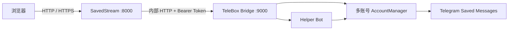

# SavedStream Private — 项目基本说明

> 本文档是根据当前仓库结构整理的基础概览，适合快速了解项目组成、启动方式、核心接口与目录结构。更完整的部署与安全说明见 [README.md](README.md) 与 [_src/README.md](_src/README.md)。
> 最近一次功能迭代（媒体库视图/文件夹/信箱/后台分页/主题/备份管理/存储感知）的变更总结见 [CHANGELOG.md](CHANGELOG.md)，详细设计见第 16 节。

## 1. 项目是什么

SavedStream 是一个基于 Telegram「收藏夹（Saved Messages）」的私人媒体库：

- 浏览器负责展示与播放，按需从 Telegram 拉取缩略图和媒体分块，不需要把整个媒体库下载到本地磁盘。
- 服务端由 **SavedStream（FastAPI + React）** 和 **TeleBox Bridge（Telegram userbot）** 两个容器组成。
- 支持多账号托管、Helper Bot 入库、公开相册、用户注册/审核、限流和加密媒体缓存。
- 磁盘上的缩略图与媒体分块使用 AES-256-GCM 加密；浏览器使用 RSA-OAEP 设备密钥解密播放。

本项目基于 [TeleBoxOrg/TeleBox](https://github.com/TeleBoxOrg/TeleBox) 改造，保留其 LGPL-2.1 许可证。

## 2. 总体架构



- 宿主机只发布 SavedStream 的 `127.0.0.1:8000`。
- TeleBox Bridge 的 `9000` 端口只在 Compose 内部网络可用，不直接暴露。
- 可选 Caddy 容器提供 80/443 反向代理与 HTTPS。

## 3. 目录结构

```text
D:\tube
├── _src/                          # SavedStream 应用与部署配置
│   ├── backend/
│   │   ├── app/                   # FastAPI 应用与核心模块
│   │   └── tests/                 # 后端 pytest 测试
│   ├── frontend/                  # React + Vite + TypeScript
│   │   ├── src/                   # 页面、鉴权、媒体解密、API 客户端
│   │   └── dist/                  # 前端构建产物（Docker 使用）
│   ├── scripts/                   # 辅助脚本
│   ├── Dockerfile                 # SavedStream 镜像
│   ├── docker-compose.yml         # telebox + savedstream + caddy
│   ├── Caddyfile                  # 反向代理配置
│   ├── .env.example               # 环境变量模板
│   └── README.md                  # 应用级文档
├── TeleBox/                       # Telegram userbot 与多账号 Bridge 改造
│   ├── src/
│   │   ├── index.ts               # 原始 TeleBox 入口
│   │   ├── bridge.ts              # Bridge HTTP 服务入口（Docker 使用）
│   │   ├── bridge-media.ts        # Bridge 媒体辅助逻辑
│   │   ├── web-login.ts           # Helper Bot 网页登录码
│   │   ├── plugin/                # 内置 Telegram 命令插件
│   │   └── utils/                 # 运行时、插件、面板等工具
│   ├── Dockerfile.bridge          # Bridge 镜像
│   ├── bridge-entrypoint.sh       # Bridge 容器入口
│   ├── package.json               # Node 依赖与脚本
│   └── README.md                  # 上游 TeleBox 文档
├── deploy.ps1                     # Windows 一键打包/上传/更新部署
├── deploy.config.json             # 本机部署连接信息（已忽略，含 DPAPI 加密密码）
├── LICENSE                        # LGPL-2.1
└── README.md                      # 项目主文档
```

## 4. 核心组件

### 4.1 SavedStream 后端（_src/backend/app）

| 模块 | 作用 |
| --- | --- |
| `main.py` | FastAPI 入口、生命周期、全部 HTTP 路由与访问控制依赖 |
| `config.py` | 读取环境变量，生成 `Settings` |
| `database.py` | SQLite（aiosqlite）表结构：设置、媒体索引、同步状态、用户、会话、审查、流量等 |
| `auth.py` | 用户/管理员认证、密码、session、挑战与审计 |
| `security.py` | 密钥哈希、常量时间比较、Token 签名 |
| `media_crypto.py` | AES-GCM 缓存加密、RSA-OAEP 设备密钥相关逻辑 |
| `cache.py` | 磁盘缓存：加密读写、并发锁、容量淘汰 |
| `media_indexer.py` | 账号媒体索引、同步、入库对账、审核状态流转 |
| `telebox_client.py` | 调用 TeleBox Bridge `/v1/*` 接口 |
| `telegram_service.py` | 面向 Telegram 的服务封装（二维码登录、会话等） |
| `ranges.py` | HTTP Range 解析，支持视频拖动播放 |
| `traffic.py` | 进程内流量活动统计与月度额度控制 |

主要 API 分组：

- `/api/status`、`/api/public/status`：公开状态
- `/api/admin/*`：管理员登录、配置、账号、媒体审核、邀请码、流量、缓存
- `/api/auth/*`、`/api/access/*`、`/api/security/device-key`：用户/访问者认证与设备密钥
- `/api/media*`：媒体列表、时间线、缩略图、加密缩略图/分块、Range 流
- `/healthz`：健康检查

### 4.2 SavedStream 前端（_src/frontend/src）

| 文件 | 作用 |
| --- | --- |
| `main.tsx` / `App.tsx` | React 入口与顶层状态/门控 |
| `GalleryPage.tsx` | 媒体库浏览与播放页 |
| `AdminPage.tsx` | 管理后台 |
| `AuthPanels.tsx` | 管理员密钥、公开相册密钥、Telegram 访问认证等面板 |
| `MediaCrypto.tsx` | 浏览器端 RSA-OAEP 设备密钥与媒体解密 |
| `api.ts` | fetch 封装与错误码翻译 |
| `I18n.tsx` / `ThemeSelector.tsx` | 中英文与主题 |
| `types.ts` | 前端类型 |

前端构建后由 FastAPI 作为静态站点提供。

### 4.3 TeleBox Bridge（TeleBox/）

Bridge 是独立 Node.js 服务，监听 `9000`，通过 Bearer Token 鉴权。主要内部接口：

| 接口 | 作用 |
| --- | --- |
| `GET /healthz` | 健康检查 |
| `GET/POST /v1/accounts` | 列出/创建托管账号 |
| `GET /v1/accounts/{id}/status` | 账号连接状态 |
| `POST /v1/accounts/{id}/login/qr` | 发起二维码登录 |
| `GET /v1/accounts/{id}/login` | 登录状态 |
| `POST /v1/accounts/{id}/start` / `/stop` | 启动/停止账号 |
| `PUT /v1/helper-bot`、`/v1/helper-bot/status`、`/v1/helper-bot/rate-limit` | Helper Bot 配置与限流 |
| `POST /v1/web-login/consume` | 消费网页登录码 |
| `GET/POST /v1/accounts/{id}/invites` | 邀请码 |
| `GET/DELETE /v1/bindings` | 提交者绑定 |
| `GET /v1/ingest/jobs`、`.../retry`、`.../review` | 入库任务与审核 |
| `GET /v1/accounts/{id}/media` | 媒体列表 |
| `POST /v1/accounts/{id}/media/sync` | 触发同步 |
| `POST /v1/accounts/{id}/upload` | 上传到收藏夹 |
| `GET /v1/accounts/{id}/media/{message_id}` | 媒体详情 |
| `GET .../thumbnail`、`.../stream` | 缩略图与分块/流媒体 |

Bridge 使用 SQLite（`bridge.db`）保存邀请码、绑定关系、入库任务、限流数据；使用 `accounts.json` 保存多账号配置；Helper Bot Token 使用 `TELEBOX_SECRET_KEY` 加密存储。

## 5. 关键数据流

1. **登录托管账号**：管理页填写 API ID/API Hash → SavedStream 调 Bridge 发起二维码 → 手机扫码 → TeleBox 保存 StringSession 到 `/data`。
2. **索引媒体**：SavedStream 定期同步各账号 `Saved Messages`，写入 `media_index` 表；同步状态保存在 `media_sync_state`。
3. **播放媒体**：浏览器请求 `/api/media/{id}/stream` → SavedStream 通过 Bridge 按分块获取 Telegram 媒体 → 加密写入缓存 → 浏览器设备密钥解密 → MediaSource 播放。
4. **Helper Bot 入库**：提交者私聊 Bot 发送 `/bind <邀请码>` → 绑定账号 → 后续媒体形成 ingest job → userbot 转发到目标账号收藏夹 → SavedStream 对账并进入审核/可见性流程。

## 6. 配置与启动

### 6.1 环境变量（_src/.env）

| 变量 | 必填 | 说明 |
| --- | --- | --- |
| `TELEGRAM_API_ID` / `TELEGRAM_API_HASH` | 否/部署时 | Telegram 应用凭据 |
| `ADMIN_KEY` | 是 | 管理后台密钥 |
| `MEDIA_CACHE_KEY` | 是 | 磁盘媒体缓存 AES-256-GCM 密钥，需长期保持不变 |
| `TELEBOX_API_TOKEN` | 是 | SavedStream 调 Bridge 的 Bearer Token |
| `TELEBOX_SECRET_KEY` | 是 | Bridge 加密 Bot Token 与 session 相关数据的密钥 |
| `PORT` | 否 | 默认 `8000` |
| `COOKIE_SECURE` | 否 | HTTPS 时设 `true` |
| `SESSION_COOKIE_DAYS` | 否 | 浏览器登录有效期 |
| `CADDY_SITE` | 否 | Caddy 站点域名 |
| `SAVEDSTREAM_IMAGE` / `TELEBOX_IMAGE` | 否 | 镜像名 |

### 6.2 Docker Compose

```bash
cd _src
cp .env.example .env
# 编辑 .env，至少填写 ADMIN_KEY、MEDIA_CACHE_KEY、TELEBOX_API_TOKEN、TELEBOX_SECRET_KEY
docker compose up -d --build
docker compose ps
```

### 6.3 Windows 一键部署

```powershell
powershell -ExecutionPolicy Bypass -File .\deploy.ps1
# 重新输入配置
powershell -ExecutionPolicy Bypass -File .\deploy.ps1 -ResetConfig
```

## 7. 开发与测试

后端：

```bash
cd _src/backend
python -m pip install -r requirements-dev.txt
python -m pytest -q
```

前端：

```bash
cd _src/frontend
npm install
npm run build   # 构建
npm test        # Vitest
```

TeleBox Bridge：

```bash
cd TeleBox
npm install
npx tsc --noEmit
```

## 8. 数据与安全要点

- Telegram session、Bot Token、SQLite 数据库都保存在 Docker 持久卷，`/data` 是敏感数据。
- `MEDIA_CACHE_KEY` 只影响媒体缓存；更换后缓存失效，但 Telegram session 与本地标题不受影响。
- 本项目不对现有 Telegram 媒体提供严格的端到端加密：TeleBox 内存中会短暂接触 Telegram 明文，之后再进入加密缓存与浏览器传输层。
- 不要提交 `.env`、`deploy.config.json`、session、数据库或卷备份。
- 对外公开前应启用访问限制和 HTTPS，并保留 `Range` 请求头以支持视频拖动播放。

## 9. SavedStream API 详解

### 9.1 访问控制模型

FastAPI 通过 Cookie 和 SQLite 会话识别当前访问者，核心依赖为 `require_admin` 与 `require_media_access`（后者别名 `require_viewer`）。

| Cookie / Token | 用途 |
| --- | --- |
| `savedstream_admin` | 管理员控制面登录态，由 `TokenSigner` 签名 |
| `savedstream_auth` | 用户/公开相册登录态，对应 `auth_sessions` 表 |
| `X-SavedStream-Browser-ID` | 浏览器指纹，用于限制 session 和可信设备绑定 |

访问者主体字段：

- `role`：`user` / `admin` / `superadmin`
- `status`：`pending` / `approved` / `disabled` / `denied`
- `binding_sync_status`：`pending` / `ready` / `error` / `not_required`

主要规则：

1. 管理员接口要求 `is_admin`，否则返回 `401 ADMIN_AUTH_REQUIRED`。
2. 媒体接口要求公开相册已开启，且用户 `approved` 且绑定同步状态为 `ready`。
3. 公开媒体必须满足 `visibility=public`、`review_status=approved` 且 `hidden=0`；提交者可以在“我的公开”看到自己未隐藏的待审、公开、驳回与撤回资源。
4. 私人媒体只允许所有者和管理员读取；广场/我的点赞可以跨托管账号读取已经审核通过的公开资源，最终媒体流仍由 `indexed_media_for_principal` 二次鉴权。

### 9.2 路由清单

| 分组 | 方法与路径 | 说明 |
| --- | --- | --- |
| 状态 | `GET /api/status`、`GET /api/public/status` | 站点/公开相册状态 |
| 管理员引导 | `POST /api/admin/bootstrap`、`POST /api/admin/recovery`、`POST /api/admin/login`、`POST /api/admin/logout` | 初始化、恢复与旧版管理员登录 |
| 用户认证 | `POST /api/auth/register/start`、`GET /api/auth/register/status`、`POST /api/auth/login`、`GET /api/auth/session`、`POST /api/auth/logout` | 注册挑战、登录与会话 |
| 设备与密码 | `POST /api/auth/device/verify/start`、`GET /api/auth/device/verify/status`、`POST /api/auth/password/reset/start`、`POST /api/auth/password/reset/complete` | 可信设备验证、密码重置 |
| 旧账号迁移 | `POST /api/auth/legacy-claim/start`、`GET /api/auth/legacy-claim/status`、`POST /api/internal/auth/telegram-challenge/claim` | 将旧 Telegram 访问账号迁移到用户体系 |
| 旧访问流程（兼容） | `POST /api/access/telegram`、`GET /api/access/telegram/status`、`POST /api/access/login`、`POST /api/public/login` | 已停用并返回 `410 Gone`；前端不得再作为登录入口 |
| 旧会话退出（兼容） | `POST /api/access/telegram/logout`、`POST /api/access/logout`、`POST /api/public/logout` | 清理升级前遗留 Cookie / session |
| QR 登录 | `POST /api/auth/qr`、`GET /api/auth/qr/status`、`POST /api/auth/password`、`POST /api/auth/logout` | 管理页二维码登录与两步验证 |
| 设备密钥 | `GET/POST/DELETE /api/security/device-key` | 浏览器 RSA-OAEP 设备公钥注册、查询、吊销 |
| 媒体浏览 | `GET /api/media?view=private\|square\|my_public\|liked`、`GET /api/media/timeline`、`GET /api/accounts` | 私人相册、广场、我的公开、我的点赞、时间线与账号列表 |
| 点赞与举报 | `PUT/DELETE /api/media/{id}/like`、`POST /api/media/{id}/reports` | 幂等点赞/取消、自赞拒绝、提交举报 |
| 媒体读取 | `GET /api/media/{id}/thumbnail`、`GET /api/media/{id}/encrypted-thumbnail`、`GET /api/media/{id}/encrypted-chunk`、`GET /api/media/{id}/stream` | 缩略图、加密缩略图/分块、Range 流 |
| 管理设置 | `GET/PUT /api/admin/settings`、`DELETE /api/admin/cache` | 缓存上限、访问限制、清缓存 |
| 公开相册与注册策略 | `GET/PUT /api/admin/public-album`、`POST /api/admin/public-album/key`、`POST /api/admin/public-album/registration-key` | 公开开关、访问密钥、随机/自定义注册密钥、注册开关、可选的新用户审批策略 |
| 媒体同步 | `GET /api/admin/media/sync/status`、`POST /api/admin/media/sync` | 各账号同步状态与手动触发 |
| 审核 | `GET /api/admin/media/review`、`POST /api/admin/media/{id}/review`、`POST /api/admin/media/review/bulk`、`DELETE /api/admin/media/{id}` | 公开媒体审核、删除 |
| 可见性 | `PATCH /api/admin/media/{id}/visibility`、`POST /api/admin/media/visibility`、`PUT /api/admin/media/{id}` | 单个/批量公开/私密、本地标题 |
| 流量 | `GET /api/admin/traffic/summary`、`GET /api/admin/traffic/series`、`GET/PUT /api/admin/traffic/settings`、`POST /api/admin/traffic/reset` | 月度流量统计与限制 |
| WebUI 上传 | `POST /api/uploads`、`GET /api/uploads`、`GET/DELETE /api/uploads/{job_id}` | 普通用户/管理员原始文件流上传、任务查询与取消（所有者隔离） |
| 管理员上传兼容 | `POST /api/admin/uploads`、`GET/DELETE /api/admin/uploads/{job_id}` | 保留旧管理上传入口并复用上传任务管线 |
| 举报受理 | `GET /api/admin/reports`、`POST /api/admin/reports/{report_id}/resolve` | 聚合举报、忽略、下架、隐藏、删除与组合处罚 |
| 用户处罚 | `GET/POST /api/admin/users/{user_id}/sanctions`、`DELETE /api/admin/users/{user_id}/sanctions/{sanction_id}` | 处罚历史、组合处罚与提前解除 |
| 归属内容删除 | `POST /api/admin/users/{user_id}/content-deletion`、`GET/POST /api/admin/content-deletion-jobs/{job_id}[/retry]` | 异步删除可确认归属内容、进度与失败重试 |
| Helper Bot | `PUT /api/admin/helper-bot`、`GET/PUT /api/admin/helper-bot/rate-limit` | Bot Token 与限流 |
| 多账号 | `POST /api/admin/accounts`、`POST /api/admin/accounts/{id}/login/qr`、`GET/DELETE /api/admin/accounts/{id}/login`、`POST /api/admin/accounts/{id}/invites` | 账号增删、二维码登录、邀请码 |
| 绑定与用户 | `DELETE /api/admin/bindings`、`PUT /api/admin/users/{user_id}`、`PUT /api/admin/access-users/{telegram_user_id}`、`POST /api/admin/ingest/jobs/{job_id}/retry` | 新账号审批/禁用、旧访问用户兼容管理、解绑、入库重试 |
| 健康 | `GET /healthz` | 容器健康检查 |

### 9.3 常用错误码

前端 `api.ts` 会把结构化错误码翻译为中文。常见错误码：

| 错误码 | 含义 |
| --- | --- |
| `INVALID_ADMIN_KEY` | 管理员密钥错误 |
| `ADMIN_AUTH_REQUIRED` / `MEDIA_AUTH_REQUIRED` | 需要管理员/媒体访问登录态 |
| `INVALID_TELEGRAM_LOGIN_CODE` | Telegram 网页登录码无效、过期或已使用 |
| `ACCOUNT_ACCESS_DENIED` | 无权访问该托管账号 |
| `ACCESS_DISABLED` / `ACCESS_DENIED` | 访问账号被禁用或未批准 |
| `PUBLIC_ALBUM_DISABLED` | 公开相册未开启 |
| `PUBLIC_KEY_REQUIRED` / `INVALID_PUBLIC_KEY` / `PUBLIC_KEY_NOT_CONFIGURED` | 公开相册访问密钥问题 |
| `BINDING_SYNC_PENDING` | Telegram 绑定尚未同步完成 |
| `MEDIA_INDEX_PENDING` | 媒体索引尚未建立 |
| `MEDIA_NOT_FOUND` | 媒体不存在或无权访问 |
| `TELEGRAM_UNAVAILABLE` | TeleBox Bridge 或 Telegram 不可用 |
| `TRAFFIC_LIMIT_REACHED` | 月度流量额度已耗尽（HTTP 509） |
| `UPLOAD_QUOTA_REACHED` | WebUI/Helper Bot 共享的个人文件数、字节数或并发额度已达到上限 |
| `UPLOAD_MUTED` / `LOGIN_BANNED` / `REPORTING_DISABLED` | 用户受到上传、登录或举报处罚；响应含理由、解除时间和是否永久 |
| `SELF_LIKE_FORBIDDEN` / `SELF_REPORT_FORBIDDEN` | 禁止给自己的资源点赞或举报自己的资源 |
| `REPORT_ALREADY_OPEN` | 同一举报者对同一媒体已有未完结举报 |

## 10. 数据库表概览

后端 SQLite 数据库位于 `/data/savedstream.db`，由 `Database.initialize` 建表。主要表：

| 表 | 作用 |
| --- | --- |
| `auth_users` | 用户/管理员账号、角色、状态、Telegram 绑定 |
| `auth_sessions` | 用户登录会话 |
| `auth_challenges` | 注册、设备验证、密码重置、旧账号认领挑战 |
| `trusted_devices` | 用户可信浏览器设备 |
| `auth_audit_events` | 认证审计日志 |
| `auth_rate_limits` | 登录失败限流桶 |
| `settings` | 站点设置、缓存上限、公开相册、访问限制 |
| `media_metadata` / `media_metadata_v2` | 本地标题（v2 支持多账号） |
| `device_keys` | 浏览器设备公钥 |
| `media_users` | 旧版 Telegram 媒体访问用户 |
| `access_sessions` | 旧版访问会话 |
| `media_index` | 多账号媒体索引、所有者、上传来源/批次、可见性、审核状态 |
| `media_sync_state` | 每账号同步游标、状态与错误 |
| `ingest_reconcile_state` | Helper Bot 入库任务对账游标 |
| `media_review_events` | 审核事件历史 |
| `media_deletion_events` | 媒体删除事件 |
| `review_sync_outbox` | 审核结果向 Bridge 同步的待发送队列 |
| `media_timeline_buckets` | 按年/月/日预聚合的时间线桶 |
| `upload_jobs` | WebUI/管理员上传任务、所有者、请求可见性、批次与共享配额预约 |
| `media_likes` | 用户对公开媒体的幂等点赞 |
| `media_reports` | 举报证据、媒体快照和受理状态 |
| `user_sanctions` | 可过期、可组合、可提前解除的细粒度处罚 |
| `content_deletion_jobs` / `content_deletion_job_items` | 可确认归属内容的异步删除任务、逐项进度和失败原因 |
| `traffic_usage_buckets` | 按时间桶统计的流量 |
| `traffic_limit_settings` | 月度流量设置 |
| `media_folders` | 多级文件夹（`parent_id=0` 为根，同级名称唯一） |
| `media_folder_items` | 文件夹与媒体的多对多关联 |
| `notifications` | 信箱通知（每用户一行，广播展开写入） |

## 11. TeleBox Bridge 详细

### 11.1 持久化文件

Bridge 数据目录 `/data` 下：

| 文件/目录 | 内容 |
| --- | --- |
| `accounts.json` | 多账号配置（api_id、api_hash、session） |
| `bridge.db` | 邀请码、绑定、入库任务、限流、网页登录码 |
| `helper-bot.enc` | 使用 `TELEBOX_SECRET_KEY` 加密的 Helper Bot Token |
| `media-cache/` | Bridge 侧媒体临时缓存 |
| `upload-spool/` | 上传文件暂存目录（0700 权限） |

### 11.2 账号状态

`accounts.json` 中每个账号有运行时状态：

| 状态 | 含义 |
| --- | --- |
| `starting` | 已保存配置，等待连接 |
| `unauthenticated` | 未登录或无 session |
| `qr_login` | 二维码登录进行中 |
| `authenticated` | 已连接并可用 |
| `stopped` | 已停止 |
| `error` | 连接失败 |

### 11.3 入库任务状态机

Helper Bot 收到的媒体会创建 `jobs` 记录，主要状态流转：

`received → routing → awaiting_choice → rate_checking → delivered → importing → completed`

其他状态：

| 状态 | 含义 |
| --- | --- |
| `failed` | 任务失败，`error` 保存原因 |
| `retry_wait` | 等待重试 |
| `deleted` | 已被管理员删除 |
| `awaiting_choice` | 等待提交者选择公开/私密 |
| `rate_checking` | 执行限流配额检查 |

### 11.4 Helper Bot 命令与行为

- `/bind <邀请码>`：将当前 Telegram 用户绑定到目标账号。
- `/web`：旧版一次性网页登录码已停用；命令只提示用户返回 SavedStream 网页使用用户名/密码登录，旧 `/api/access/telegram` 消费流程返回 `410 Gone`。
- `/start <challenge>`：Helper Bot 将注册/设备确认挑战转发给 SavedStream 内部接口完成 Telegram 身份确认。
- 私聊转发媒体：Bot 收到媒体后创建入库任务，先询问可见性，再写入目标账号 Saved Messages。
- 公开选择进入审核队列；私密选择无需管理员审核。
- 限流设置包括：`per_user_files_24h`、`per_user_bytes_24h`、`per_user_concurrent`、`max_file_bytes`、`global_files_per_minute`、`max_album_items`、`max_album_bytes`。
- Helper Bot 在接收、可见性选择和失败重试前查询 SavedStream 内部处罚状态；WebUI 与 Bot 在 Bridge 的同一 `helper_rate_events` / `helper_rate_reservations` 账本中预约、完成或释放个人额度。
- 内部协作接口：`GET /api/internal/moderation/users/{telegram_user_id}`、`POST /v1/upload-quota/reservations`、完成/释放预约接口，以及 `POST /v1/ingest/users/{telegram_user_id}/cancel`。

## 12. 前端页面与门控

### 12.1 顶层门控流程

`App.tsx` 根据 `/api/status` 决定渲染哪个界面：

1. 服务未配置 → 提示配置核心密钥与内部 Bridge。
2. 未登录 → 渲染 `AccountAuthGate`，提供 SavedStream 用户名/密码登录；管理员开放注册时同时显示注册入口。
3. 注册 → 调用 `/api/auth/register/start`，用户通过 Helper Bot 完成 Telegram 身份确认，前端轮询 `/api/auth/register/status` 后自动登录。`registration_requires_approval=1`（默认）时等待管理员审批；关闭后，仅当用户存在有效 `/bind` 托管账号绑定时自动设为 `approved/ready`。
4. 已批准用户从新浏览器登录 → 调用 `/api/auth/login` 后进入 Telegram 设备确认，轮询 `/api/auth/device/verify/status`。
5. 待审核、被拒绝、被禁用或绑定同步中 → 渲染 `AccountStateGate`，不再调用旧 `/api/access/telegram` 或 `/api/public/login`。
6. Telegram 托管账号未连接 → 管理员进入 `/admin` 配置；普通用户看到服务暂不可用提示。
7. 全部通过 → 进入 `MediaEncryptionGate`，再渲染 `GalleryPage`。

### 12.2 页面与面板

| 组件 | 作用 |
| --- | --- |
| `GalleryPage` | 时间线、媒体卡片、图片/视频/音频查看器、加密下载 |
| `AdminPage` | 管理后台，包含多个折叠面板 |
| `AdminDashboardPanel` | 概览统计与流量图 |
| `ReviewQueuePanel` | 公开媒体审核队列 |
| `HelperRateLimitPanel` | Helper Bot 限流设置 |
| `PublicAlbumPanel` | 公开相册开关与访问密钥 |
| `MediaIndexPanel` | 媒体索引同步状态 |
| `UploadPanel` | 管理员上传任务 |
| `AccessUsersPanel` | `auth_users` 账号审批、禁用与 Telegram/托管账号绑定状态管理 |
| `CoordinationPanel` | 多账号协调、二维码登录、邀请码 |
| `AuthPanels` | 用户登录/注册、Telegram 注册与设备挑战、账号状态、管理员恢复密钥面板 |
| `MediaCrypto` | IndexedDB 设备密钥、PBKDF2 解密、MediaSource 播放 |

### 12.3 浏览器端加密

- IndexedDB 数据库：`savedstream-security`，store：`device-keys`。
- 持久模式使用 RSA-OAEP 设备密钥；会话模式使用 `savedstream-media-session-key-v1`。
- PBKDF2 迭代次数为 `310_000`，保护私钥。
- 响应通过 `X-SavedStream-Wrapped-Key`、`X-SavedStream-Nonce`、`X-SavedStream-AAD` 等头完成 RSA-OAEP + AES-GCM 解包。
- 视频优先使用 MediaSource + 解密分块；不支持的编码回退到加密下载。

## 13. 部署与运维

### 13.1 deploy.ps1 流程

`deploy.ps1` 在 Windows 上执行：

1. 读取或输入服务器 IP、SSH 用户、域名；密码用 DPAPI 加密保存到 `deploy.config.json`。
2. 检查 `docker-compose.yml`、`Dockerfile.bridge` 和本机 `tar.exe`。
3. 打包 `_src` 与 `TeleBox`，排除 `.env`、`node_modules`、`dist`、`__pycache__`、session 等敏感/生成内容。
4. 优先使用 `-PrebuiltImageArchive` 或本地 Docker 导出的 Linux 镜像；未提供预构建镜像且本地 Docker 不可用时，自动回退到服务器构建，保证一键部署流程不中断。
5. 上传、备份旧代码与数据卷、更新容器、健康检查。
6. 新版本失败时恢复旧代码和数据卷。
7. 检测 Caddy 端口并回显应添加的反代配置。

常用参数：

- `-PackageOnly`：仅验证打包内容。
- `-ResetConfig`：清除已保存的部署连接信息。
- `-PrebuiltImageArchive <path>`：复用包含 Docker `*.tar` 成员的 gzip tar 镜像归档（`RepoTags` 需匹配 `savedstream` 与 `telebox`），跳过本地构建和服务器构建。
- `-AllowServerBuild`：兼容旧命令的保留参数；当前本地 Docker 不可用时会自动回退到服务器构建，无需额外指定。
- `-KeepBackups 1|2`：健康检查通过后保留最近 1 或 2 份备份，默认 `2`。

### 13.2 容器与健康检查

| 容器 | 端口 | 健康检查 |
| --- | --- | --- |
| `savedstream` | `127.0.0.1:8000` | `GET /healthz`（Python urllib） |
| `telebox` | 内部 `9000` | `GET http://127.0.0.1:9000/healthz`（Node fetch） |
| `caddy` | `80/443` | 无自定义健康检查 |

两个应用容器都使用 `read_only` 根文件系统、`no-new-privileges`、`cap_drop: ALL`，并以 UID/GID `10001` 运行。可写区域仅包括 `/data` 卷和 `tmpfs /tmp`。

### 13.3 数据卷备份

`savedstream` 使用命名卷保存 `/data/savedstream.db`、缓存、会话等；`telebox` 使用独立命名卷保存 `accounts.json`、`bridge.db`、Bot Token 密文和上传暂存。恢复或迁移时文件归属应保持 `10001:10001`。

## 14. 测试矩阵

| 位置 | 测试框架 | 主要测试文件 |
| --- | --- | --- |
| `_src/backend/tests` | pytest | 既有测试，以及 `test_square_upload_moderation.py`（四视图、点赞/举报、上传隔离、处罚与归属删除） |
| `_src/frontend/src` | Vitest | 既有测试，以及 `GalleryPage.upload.test.tsx`、`AdminPage.sanctions.test.ts` |
| `TeleBox/src` | Node 内置测试 | `bridge-media.test.ts`、`web-login.test.ts` |

## 15. 关键常量与默认值

| 常量 | 值 | 位置 |
| --- | --- | --- |
| Telegram 分块大小 | `512 KiB` | `telebox_client.py`、`telegram_service.py`、前端下载 |
| 单页扫描消息数 | `500` | `telegram_service.py` |
| 缓存默认上限 | `20 GiB`，管理页范围 `0.5–200 GiB` | `database.py`、前端 |
| 注册挑战有效期 | `15 分钟` | `auth.py` |
| 可信设备有效期 | `30 天` | `auth.py` |
| 密码长度 | `12–128` 字符 | `auth.py` |
| 网页登录码有效期 | `10 分钟` | `web-login.ts` |
| Helper 默认每用户 | `20 文件/天`、`10 GB/天`、`2 并发` | `bridge.ts` |
| Helper 默认全局 | `30 文件/分钟` | `bridge.ts` |
| 单文件/专辑默认上限 | `2 GB` | `bridge.ts` |
| 默认媒体专辑上限 | `10 个文件` | `bridge.ts` |
| 默认月度流量容量/限制 | `1 TB` / `900 GB` | `database.py` |
## 16. 媒体库增强功能（列表视图 / 文件夹 / 信箱 / 后台分页 / 主题）

本节对应 2026 年迭代新增的五个功能组。

### 16.1 可见性三态与隐藏资源

`media_index` 新增 `hidden` 列（升级时自动 `ALTER TABLE` 迁移，不影响既有数据）：

| 可见性 | 谁能看到 | 数据库表示 |
| --- | --- | --- |
| `public`（公开） | 所有已批准用户（公开相册开启时） | `visibility='public' AND review_status='approved' AND hidden=0` |
| `private`（私有） | 管理员与上传者本人 | `visibility='private' AND hidden=0` |
| `hidden`（隐藏） | 仅管理员 | `hidden=1`（行映射为 `visibility='hidden'`） |

- 隐藏行对公开列表、私人列表、时间线、所有者查询和缩略图/流式接口全部不可见（`indexed_media_for_principal` 与 `list_media_index` / `list_timeline` 双层过滤）。
- 管理员通过 `PATCH /api/admin/media/{id}/visibility` 与 `POST /api/admin/media/visibility`（批量）切换三态；隐藏→私有只会解除隐藏，不会自动重新公开。
- 审核通过（`review_media`）与删除（`tombstone_media`）会自动清除 `hidden` 标记。

### 16.2 文件夹（多级）

新表 `media_folders`（`parent_id=0` 表示根级，`(parent_id, name)` 唯一）与 `media_folder_items`（一个文件可属于多个文件夹）：

- `GET /api/folders`：所有登录用户可读；非管理员只能看到自己可见媒体的计数。
- `POST /api/admin/folders`、`PATCH /api/admin/folders/{id}`（重命名/移动，含循环移动校验）、`DELETE /api/admin/folders/{id}`（递归删除子树与关联项）。
- `PUT/DELETE /api/admin/folders/{id}/items`：批量放入/移出媒体。
- `GET /api/media?folder_id=N`：按文件夹过滤媒体列表，可见性规则照常生效。
- **前端交互（2026 第二轮调整）**：文件夹不再放侧边栏，而是直接渲染在网格视图（文件夹卡片）与列表视图（文件夹行）的媒体区顶部，点击进入下一级；标题上方有完整路径面包屑（全部文件 / 上级 / 当前文件夹），每一级可点击跳回；管理员可在视图内“新建文件夹”（创建于当前目录）、悬停卡片/行重命名或删除（递归删除子树）；批量工具栏保留“移动到文件夹”。侧边栏只保留媒体分类。

### 16.3 信箱（通知系统）

新表 `notifications`（每用户一行；广播按用户展开写入）：

- 用户侧：`GET /api/notifications`（分页）、`GET /api/notifications/unread-count`（红点轮询，前端 25 秒一次）、`POST /api/notifications/read`（标记已读）、`DELETE /api/notifications`（删除）。
- 管理侧：`POST /api/admin/notifications`（发给指定用户或广播全部用户）、`GET /api/admin/notifications`（发送记录）。
- 自动通知钩子（`_notify_telegram_users`，按 `submitter_telegram_user_id` 映射到 `auth_users`）：
  - 审核通过 / 未通过（含理由）；
  - 管理员删除资源；
  - 可见性被改为公开 / 私有 / 隐藏。
- 前端顶部栏铃铛：未读红点徽标（99+ 封顶），面板内分类标签（审核/资源管理/系统通知）、时间、删除与“加载更多”。

### 16.4 管理后台分页化

`AdminPage.tsx` 当前包含 14 个分区页签（localStorage 记住选择）：

仪表盘 · Telegram 与多账号 · 审核队列 · 举报受理 · 用户管理 · 公开相册 · 媒体库 · 上传 · 流量限额 · 本地缓存 · Bot 限流 · 站内信 · 备份 · 存储。

各配置页的保存按钮统一使用右侧悬浮动作条（`.admin-sticky-actions` / `.admin-save-float`，sticky 贴底、靠右、带阴影），滚动页面时保持可触及。

### 16.5 用户界面主题切换

主题选择器（跟随系统 / 午夜深色 / 石墨深色 / 纸张浅色 / 暖沙浅色）从管理员后台扩展到普通用户界面：`GalleryPage` 顶部栏与 `AdminPage` 顶部栏都渲染 `ThemeSelector`，选择结果写入 `localStorage` 的 `savedstream-theme`，经 `useTheme()` 全局生效。

### 16.6 新接口速查

| 方法 | 路径 | 说明 |
| --- | --- | --- |
| GET | `/api/folders` | 文件夹树（含可见计数） |
| POST/PATCH/DELETE | `/api/admin/folders[/{id}]` | 新建/重命名·移动/删除 |
| PUT/DELETE | `/api/admin/folders/{id}/items` | 放入/移出媒体 |
| GET | `/api/media?folder_id=N` | 按文件夹列出媒体 |
| GET | `/api/notifications` | 我的通知（分页） |
| GET | `/api/notifications/unread-count` | 未读数（红点） |
| POST | `/api/notifications/read` | 标记已读（ids 或 all） |
| DELETE | `/api/notifications` | 删除通知 |
| POST | `/api/admin/notifications` | 发送通知（user_id 或广播） |
| GET | `/api/admin/notifications` | 发送记录 |
| PATCH | `/api/admin/media/{id}/visibility` | 可见性支持 `hidden` |

新增测试：`_src/backend/tests/test_library_features.py`（隐藏可见性、文件夹层级、通知收发、API 集成），前端 `GalleryPage.test.ts` 增加可见性标签用例、`GalleryPage.listview.test.tsx` 增加视图内文件夹/面包屑、列表文件夹行、纵向时间线滚轮用例。

### 16.61 纵向时间线滚轮（第二轮交互调整）

- 原侧边栏内的横向滑块时间线改为**固定在侧边栏与主内容之间的纵向时间轴**（桌面端）：每个节点对应一个月份，鼠标滚轮上下滚动切换（原生 wheel 监听 + passive:false，监听绑定随时间线数据可见性触发），点击节点直接跳转，当前月份高亮并自动滚动到可见位置。
- 每个节点悬浮（hover/focus）显示气泡：完整年月 + 媒体数量；节点本身只显示“MM”两位月份数字。
- 移动端（≤1023px）不渲染时间轴：`.timeline-rail { display:none }`，`.library` 外边距还原为仅侧边栏宽度。

### 16.7 列表视图与缩略图流量（修复与优化）

**列表视图无限刷新修复**：根因是列表行缩略图组件（`MediaListThumb`）向 `ThumbnailImage` 传入内联 `onError` 箭头函数，函数引用每次渲染都变化，导致缩略图拉取 effect 反复执行并无限重发请求（无报错）。修复：

- `MediaListThumb` 与 `AdminMediaThumbnail` 改用 `useCallback` 稳定回调；
- `ThumbnailImage` 内部将 `onError` 存入 ref，effect 只依赖 `src`、`fingerprint` 与 `fetchAndDecrypt`，从根上杜绝回调引用变化引发的死循环。

**二次加固（线上复现“切列表视图后循环刷新、控制台无报错”后的最终方案）**：

- `ThumbnailImage` 拉取 effect 现在**只依赖一个幂等的 `attempt` 状态**（0→1，由 IntersectionObserver 触发）；`src`、`fingerprint`、`fetchAndDecrypt`、`onError` 全部镜像进 ref 读取，任何父级/上下文的函数身份不稳定都不可能再让 effect 重跑，循环在结构上被禁止。
- 缩略图组件按 `thumbnail_url` 设置 `key`：URL 变化时干净重挂载，而不是复用旧状态。
- `MediaListView` / `MediaListRow` / `MediaListThumb` 用 `memo` + 稳定回调收敛重渲染；10 秒静默轮询用字段级比较在数据未变化时保留原数组引用，列表不再每 10 秒“闪刷”一次。
- 诊断：同一缩略图单次挂载拉取 ≥3 次、或同一 URL 连续 4 次未命中内存缓存时，控制台输出 `[savedstream] ... possible render loop` 警告（本次修复前该类循环完全无日志）。
- 回归测试 `GalleryPage.listview.test.tsx`：含“加密上下文 `fetchAndDecrypt` 每次渲染都换新函数”的对抗用例，验证拉取次数有界；`npm test` 与 `npm run build` 均通过（构建同时修复了 `AdminPage.tsx` 缺失的 `useCallback` 导入）。

**缩略图流量与加载速度优化**（三层）：

1. **浏览器 HTTP 缓存**：`GET /api/media/{id}/encrypted-thumbnail` 新增可选 `device=<fingerprint>` 查询参数作为缓存键（服务端校验其与 `X-SavedStream-Device-Key` 一致，不一致返回 403）。带 `device` 的响应改为 `Cache-Control: private, max-age=604800, immutable`（此前是 `no-store`，浏览器永不缓存、每次进页全量重下）；不带参数的老客户端保持 `no-store`。解密所需的 wrapped key / nonce / AAD 全部随响应头下发，缓存重放可正常解密；设备密钥轮换后 fingerprint 变化 → URL 变化 → 自动绕过旧缓存。
2. **前端内存 LRU**：`MediaCrypto.fetchAndDecrypt` 对 `/encrypted-thumbnail` 请求做最多 400 条的内存缓存（`thumbnailCacheRef`），同一会话内重复滚动、10 秒轮询刷新、视图切换都直接命中，不再重复请求；`reset()` 清空缓存。
3. **视口懒加载**：`ThumbnailImage` 用 `IntersectionObserver`（`rootMargin: 600px`）延迟拉取，网格首屏只下载视口附近的缩略图，滚动时逐步加载，显著降低初始流量并加快首屏；不支持 IO 的环境自动退化为立即加载。

配套改动：`MediaCryptoContextValue` 暴露 `fingerprint`；新增纯函数 `encryptedThumbnailUrl()` 并补充 Vitest 用例。

### 16.8 部署备份管理（WebUI）

每次部署（`deploy.ps1`）都会在服务器 `/opt/tube/backups` 生成一对目录：`code-<stamp>`（上一版代码 `_src` + `TeleBox`）与 `volumes-<stamp>`（4 个数据卷的 `.tgz`）。此前从不清理，多次部署后磁盘紧张。新增：

**容器挂载与权限**
- `docker-compose.yml`：`savedstream` 服务新增绑定挂载 `../backups:/backups:rw`（解析到宿主 `/opt/tube/backups`），管理台可读可删。
- `deploy.ps1`：创建备份目录后自动 `chown 10001:10001` + `chmod 700`，让容器 UID（10001）可以删除备份，同时宿主其他用户不可读；新增 `-KeepBackups` 参数（默认 `2`，最多 `2`），部署健康检查通过后自动只保留最近 N 份（旧备份成对删除），并清理中断部署遗留的孤立卷备份。

**管理 API**（全部 `require_admin`）
| 方法 | 路径 | 说明 |
| --- | --- | --- |
| GET | `/api/admin/backups` | 列出备份：按 stamp 聚合 code/volumes，含大小、文件数、修改时间、内部文件清单、可删状态（10 秒缓存） |
| DELETE | `/api/admin/backups/{stamp}` | 删除某次部署的 code + volumes 备份（stamp 白名单校验 + 路径防穿越） |
| POST | `/api/admin/backups/cleanup` | 保留策略：`{keep: 1-20, dry_run?}`；dry_run 只预览可释放空间 |

**管理后台页面**：新增“备份管理”页签（`BackupAdminPanel`）——备份列表（时间/大小/文件数、可展开查看内部文件）、单份删除（确认）、保留策略表单（输入保留份数 → 预览可释放空间 → 执行清理）。目录未挂载或不可写时给出明确的修复指引（`chown 10001:10001 /opt/tube/backups && chmod 700 /opt/tube/backups`）。

新增测试：`_src/backend/tests/test_backups.py`（聚合/大小统计、缺失目录、删除与非法 stamp、保留策略 dry-run 与执行、管理 API 鉴权与 404/422）。

### 16.9 服务端配置灾备备份

服务端配置备份与部署备份分离，使用 `.ssbak` 文件保存 SavedStream SQLite、用户/媒体索引/审核/处罚等数据，以及 TeleBox 的 `accounts.json`、`bridge.db` 和 Helper Bot 配置。payload 使用 AES-256-GCM 加密，管理员密码通过 `ADMIN_KEY` 包装后保存在 `system_backup_settings` 中，供 cron 无人值守执行。

备份任务支持五字段 cron 和 IANA 时区，默认写入管理员选择的 Telegram Saved Messages 账号，并使用 `#savedstream-system-backup:v1` 标记。索引中统一记录为 `hidden=1`、`upload_source=system_backup`，不会出现在普通相册、广场或点赞视图。Telegram 上传成功后服务端临时文件立即清理。

管理 API 包括 `/api/admin/system-backups/settings`、`/api/admin/system-backups`、`/api/admin/system-backups/run`、`/api/admin/system-backups/import`、`/api/admin/system-backups/scan-telegram`、`/api/admin/system-backups/{id}/restore` 和任务查询接口。恢复先校验归档并生成当前状态回滚快照，然后暂停索引、原子替换 SavedStream/TeleBox 数据，失败自动回滚；活动浏览器会话和访问会话不会恢复。

### 16.10 存储感知（磁盘警报与优化建议）

**后端**（`_src/backend/app/storage.py`）：

- `GET /api/admin/storage`（`require_admin`）返回完整快照：宿主磁盘（经 `/backups` 或 `/data` 探测 `shutil.disk_usage`）、`/data` 数据卷、部署备份占用（复用备份模块）、媒体缓存（`cache.stats()`）、数据库文件大小。
- 规则引擎 `evaluate_storage_metrics()`（纯函数，便于测试）生成：
  - 警报（alerts）：剩余空间 < 10%（或 < 10 GB）→ `LOW_SPACE`；< 5%（或 < 5 GB）→ `LOW_SPACE_CRITICAL`；备份占用 > 20 GB 或份数 > 6 → `BACKUPS_LARGE`；缓存占用 ≥ 上限 80% 且 > 10 GB → `CACHE_FULL`。
  - 优化建议（recommendations）：每条带动作（`cleanup_backups` / `clear_cache`），前端可直接跳转执行。
- **自动警报**：lifespan 启动后台 `storage_watchdog`（启动延迟 60 秒，之后每 6 小时检查一次）；与上次状态（`settings.storage_alert_state`）相比发生变化时，向所有已批准的管理员/超级管理员发送**信箱通知**（严重不足 / 偏低 / 已恢复三档，含剩余空间与百分比），前端铃铛红点联动；检查失败自动重试，不影响主服务。

**前端**：管理后台新增“存储”页签（`StorageAdminPanel`，60 秒自动刷新）——服务器磁盘 / 数据卷 / 部署备份 / 媒体缓存四张卡片（进度条 + 总量/已用/剩余），警报列表（严重/警告分级着色），优化建议列表（“前往备份管理”跳转备份页签、“立即清理”直接清空缓存）。

新增测试：`_src/backend/tests/test_storage.py`（健康状态、低空间/严重空间、备份过大、缓存接近上限、快照字段形状、GB 格式化）。

## 17. WebUI 上传、公开广场与举报处罚系统

### 17.1 WebUI 上传管线

1. 浏览器拖入或选择文件后，前端建立批次并为每个文件保存独立可见性；原始 `File.name` 经 `X-Upload-Filename`（Base64URL UTF-8）传递。
2. `POST /api/uploads?visibility=public|private&account=...` 在读取正文前完成账号、处罚、个人配额和 `Content-Length` 校验。
3. 服务端以 UUID 作为磁盘临时名，目录权限 `0700`、文件权限 `0600`；接收过程中同时计入月度入站流量。
4. 后台任务调用 Bridge 上传到目标账号 Saved Messages。Telegram 写入成功后完成个人配额记账，再写入本地索引；失败/取消释放尚未完成的预约并清理临时文件。
5. 普通用户公开请求写入 `requested_visibility=public`、`review_status=pending`、实际 `visibility=private`；管理员公开请求直接为 `approved/public`。
6. 上传任务包含 `owner_user_id`、`submitter_telegram_user_id`、`requested_visibility`、`review_status`、`batch_id`、`upload_source`；媒体索引保存所有者、来源和 `upload_batch_id`。任务读取/取消只允许所有者或管理员。

WebUI 与 Helper Bot 的个人额度共用 TeleBox `bridge.db`：

- `helper_rate_reservations`：未完成预约，参与并发、文件数和字节数的预占计算；
- `helper_rate_events`：成功写入 Telegram 后的 24 小时计费事件；
- 失败/正文长度不符/取消：释放预约；
- 管理员账号：跳过个人额度；SavedStream 月度总流量是否绕过仍由 `traffic_limit_settings.admin_bypass` 决定。

### 17.2 四种媒体集合

| `view` | 查询规则 | 用途 |
| --- | --- | --- |
| `private` | 所有者匹配、`requested_visibility=private`、当前私有、未隐藏 | 我的相册 |
| `square` | `visibility=public AND review_status=approved AND hidden=0` | 公开广场 |
| `my_public` | 所有者匹配、`requested_visibility=public`、未隐藏 | 待审/已公开/驳回/撤回 |
| `liked` | 当前仍满足广场可见性且存在当前用户点赞 | 我的点赞 |

广场、私人相册和我的点赞不返回 Telegram 身份、审核理由/操作者、审核批次、上传来源或内部配额字段；“我的公开”和管理员视图才返回审核状态与原因。媒体缩略图、播放和下载继续经过设备密钥与加密媒体接口。

### 17.3 举报状态与媒体处置

举报状态：`open → processing → resolved|ignored|failed`。同一举报者对同一媒体在 `open/processing/failed` 期间不能重复提交；`failed` 会继续出现在管理员可受理列表。

| 处置 | 结果 |
| --- | --- |
| 忽略 | 举报完结，不修改媒体 |
| 下架 | 审核状态改为 `revoked`，媒体转私人，上传者在“我的公开”可见 |
| 隐藏 | `hidden=1`，仅管理员可见 |
| 删除 | 先删除 Telegram Saved Message/Helper Bot 入库任务，再清缓存和本地索引；任一步失败则举报保持 `failed` |

举报完结会向所有相关举报者发送感谢站内信；上传者会收到媒体处置与处罚通知，但不会获知举报者身份。

### 17.4 处罚与角色保护

| 类型 | 限制 |
| --- | --- |
| `upload_mute` | 允许登录/浏览，拒绝 WebUI 与 Helper Bot 上传 |
| `login_ban` | 拒绝账号登录、Telegram 挑战确认、绑定和上传；创建时撤销现有会话与可信设备 |
| `report_mute` | 拒绝继续提交举报 |

处罚可以组合，每项有独立理由和 `expires_at`（空值表示永久），创建同类新处罚会提前结束旧的生效记录。结构化错误包含 `code`、`sanction_type`、`reason`、`expires_at`、`permanent`。普通管理员只能处罚普通用户；超级管理员可以处罚管理员，但不能处罚自己，也不能使最后一个有效超级管理员失去管理能力。

“删除全部归属内容”只选择满足以下条件的媒体：所有者可由 `owner_user_id` 或安全回填的 Telegram 身份确认，且来源为 WebUI/Helper Bot（或存在明确的入库任务 ID）。任务逐项保存 `pending/completed/failed`，Telegram 删除失败不会虚假完成，可从用户管理页重试失败项。

### 17.5 反向代理要求

- 代理请求体上限必须不小于管理页配置的单文件上限；Nginx 可设置 `client_max_body_size`，Caddy 可使用 `request_body max_size`。
- 建议关闭 Nginx `proxy_request_buffering`，让请求流直接进入 SavedStream 的受限暂存目录。
- 大文件上传和 Telegram 入库需要较长的代理读写超时；示例部署使用 3600 秒。
- 必须保留 `Range` 请求头，并在 HTTPS 部署中启用 `COOKIE_SECURE=true`。
