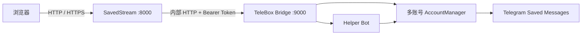

# SavedStream

家里人喜欢看电影，但设备硬盘空间有限，上传带宽也常常不够用。既然 Telegram 的“收藏夹”（Saved Messages）可以保存媒体和文件，为什么不借助它来管理电影、图片和音频，并在需要时按需加载？SavedStream 因此诞生。

SavedStream 将 Telegram 收藏夹变成一个可搜索、可播放、支持多账号的私人媒体库。文件仍保存在 Telegram，服务端只按需缓存缩略图和媒体分块，不需要提前把整个媒体库同步到硬盘。

> 本项目基于开源项目 [TeleBoxOrg/TeleBox](https://github.com/TeleBoxOrg/TeleBox) 改造，并在其基础上增加了多账号运行时、Helper Bot 入库桥接以及 SavedStream Web 管理界面。感谢 TeleBox 项目及其贡献者。

## 功能

- 浏览 Telegram 收藏夹中的图片、视频、音频和普通文件
- 支持搜索、分类、时间排序和本地标题
- 图片与视频缩略图缓存，媒体按需分块缓存
- HTTP Range 播放，可拖动视频进度
- 一个 TeleBox 容器同时托管多个 Telegram userbot 账号
- 每个账号使用独立 session、连接状态和 Saved Messages
- Helper Bot 接收媒体，通过邀请码将提交者固定绑定到目标账号
- userbot 自动将 Helper Bot 中转的文件写入自己的收藏夹
- WebUI 配置 Telegram API、扫码登录、Bot Token、邀请码和绑定关系
- 管理员密钥和可选的媒体库访问口令
- Docker 双容器部署，TeleBox API 仅在内部网络开放
- Windows PowerShell 一键上传部署、自动备份、健康检查和失败回滚

## 架构



Compose 运行两个核心容器：

- `savedstream`：FastAPI、React 静态页面、媒体缓存和本地设置
- `telebox`：Telegram userbot、多账号 session、Helper Bot 和入库任务

宿主机只在 `127.0.0.1:8000` 上发布 SavedStream。TeleBox 的 `9000` 端口不会暴露到宿主机，适合交给 Caddy、Nginx 等反向代理提供公网 HTTPS。

## Windows 一键部署

### 准备

- Windows PowerShell 5.1 或 PowerShell 7
- 一台可通过 SSH 登录的 Linux 服务器
- 服务器已安装 Docker Engine 和 Docker Compose v2
- 本地安装 Docker Desktop 时会优先在本机构建 Linux 镜像；没有本地 Docker 时会回退到服务器构建

运行：

```powershell
powershell -ExecutionPolicy Bypass -File .\deploy.ps1
```

首次运行会询问服务器 IP、域名和 SSH 密码。脚本会：

1. 自动生成管理密钥、TeleBox API Token 和加密密钥。
2. 上传源码或本地预构建镜像。
3. 备份服务器上的旧代码和 Docker 数据卷。
4. 更新容器并执行健康检查。
5. 新版本失败时恢复旧代码和数据卷。
6. 回显管理地址和 `ADMIN_KEY`。
7. 检测现有 Caddy；端口已被占用时只输出应添加的反代配置。

部署连接信息会保存在本机 `deploy.config.json`。SSH 密码使用当前 Windows 用户的 DPAPI 加密，后续直接执行同一条命令即可更新。要重新输入配置：

```powershell
powershell -ExecutionPolicy Bypass -File .\deploy.ps1 -ResetConfig
```

部署不会删除现有媒体缓存、账号 session、任务数据库或本地标题。

## Docker Compose 部署

```bash
cd _src
cp .env.example .env
```

编辑 `.env`，至少设置：

```dotenv
ADMIN_KEY=请使用随机长密钥
TELEBOX_API_TOKEN=请使用随机长密钥
TELEBOX_SECRET_KEY=请使用随机长密钥
```

然后启动：

```bash
docker compose up -d --build
docker compose ps
```

访问 `http://127.0.0.1:8000/admin`，在管理页中：

1. 新增托管账号并填写 Telegram `API ID` 与 `API Hash`。
2. 使用 Telegram 手机客户端扫描二维码登录。
3. 填写从 BotFather 获取的 Helper Bot Token。
4. 为目标账号生成邀请码。
5. 提交者私聊 Helper Bot 发送 `/bind <邀请码>`。

完成绑定后，提交者发给 Helper Bot 的图片、视频、音频和文件会自动进入对应账号的收藏夹。

## 反向代理

SavedStream 默认只监听宿主机回环地址。已有 Caddy 时可加入：

```caddyfile
media.example.com {
    encode zstd gzip
    reverse_proxy 127.0.0.1:8000
}
```

使用 HTTPS 时将 `_src/.env` 中的 `COOKIE_SECURE` 设置为 `true`。代理应保留 `Range` 请求头，否则视频拖动播放会受到影响。

## 数据与安全

- Telegram session、Bot Token 和 SQLite 数据库都位于 Docker 持久卷中。
- Helper Bot Token 使用 `TELEBOX_SECRET_KEY` 加密后保存。
- 不要提交 `.env`、`deploy.config.json`、session、数据库或数据卷备份。
- Telegram session 等同于账号登录凭据，应限制服务器和备份文件的访问权限。
- 媒体库对公网开放前，请启用访问限制并配置 HTTPS。
- 本项目不负责转码，能否在浏览器直接播放取决于媒体编码格式。
- 使用时请遵守 Telegram 服务条款以及所在地法律法规，仅存储和分享你有权处理的内容。

## 开发与测试

后端：

```bash
cd _src/backend
python -m pip install -r requirements-dev.txt
python -m pytest -q
```

前端：

```bash
cd _src/frontend
npm install
npm run build
```

TeleBox Bridge：

```bash
cd TeleBox
npm install
npx tsc --noEmit
```

## 目录

```text
.
|-- _src/          SavedStream 后端、前端和 Compose 配置
|-- TeleBox/       TeleBox 上游代码及多账号 Bridge 改造
|-- deploy.ps1     Windows 自动上传与更新部署脚本
`-- README.md
```

## 开源许可

本项目包含基于 TeleBox 改造的代码，使用 [GNU Lesser General Public License v2.1](LICENSE) 发布。TeleBox 的原始版权和许可声明保留在 `TeleBox/` 目录中。
