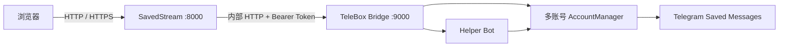

# SavedStream Private

> **快速迭代声明 / Fast iteration notice:** 当前程序处于快速迭代期，使用过程中可能出现各种体验不佳或 bug，欢迎在 GitHub 提交 issue 反馈。

> Personal private edition. This snapshot is published to the public SavedStream repository for collaborative iteration.

## Telegram 多账号容灾

管理员可以在“Telegram 与多账号”中将已扫码账号加入逻辑账号组并标记为备用容灾账号。备用账号会从主账号 Saved Messages 最早消息开始按保守速率限流同步，系统使用稳定 marker、指纹和映射表去重；新入库媒体会异步复制到所有启用副本。主账号连续 3 次健康检查失败后，系统可自动切换到已完成同步的最高优先级副本；主账号恢复后不会自动切回。复制失败不阻塞主流程，会在后台保留重试任务和错误状态。

## Encrypted media edition

- Thumbnail and media cache files are encrypted at rest with AES-256-GCM and the independent `MEDIA_CACHE_KEY`.
- The browser creates an RSA-OAEP device key. Its private key is password-encrypted with PBKDF2/AES-GCM and stored only in IndexedDB.
- SavedStream wraps a random AES-GCM response key to the registered device public key for every thumbnail and media chunk. Decryption happens in the browser.
- Video playback uses MediaSource and decrypted chunks when the browser and codec support it. Unsupported formats use encrypted download fallback.
- Keep `MEDIA_CACHE_KEY` unchanged across deployments. Rotating it invalidates media cache only; Telegram sessions, database records and local titles remain intact.
- This phase is not strict end-to-end encryption for existing Telegram media: TeleBox receives Telegram plaintext in server memory before the encrypted cache and browser transport layers. Upload-before-Telegram E2EE is intentionally deferred.

## SavedStream

家里人喜欢看电影，但设备硬盘空间有限，上传带宽也常常不够用。既然 Telegram 的“收藏夹”（Saved Messages）可以保存媒体和文件，为什么不借助它来管理电影、图片和音频，并在需要时按需加载？SavedStream 因此诞生。

SavedStream 将 Telegram 收藏夹变成一个可搜索、可播放、支持多账号的私人媒体库。文件仍保存在 Telegram，服务端只按需缓存缩略图和媒体分块，不需要提前把整个媒体库同步到硬盘。

> 本项目基于开源项目 [TeleBoxOrg/TeleBox](https://github.com/TeleBoxOrg/TeleBox) 改造，并在其基础上增加了多账号运行时、Helper Bot 入库桥接以及 SavedStream Web 管理界面。感谢 TeleBox 项目及其贡献者。

## 功能

- 浏览 Telegram 收藏夹中的图片、视频、音频和普通文件
- 支持搜索、分类、时间排序和本地标题
- 图片与视频缩略图缓存，媒体按需分块缓存
- HTTP Range 播放，可拖动视频进度
- 一个 TeleBox 容器同时托管多个 Telegram userbot 账号
- 每个账号使用独立 session、连接状态和 Saved Messages
- Helper Bot 接收媒体，通过邀请码将提交者固定绑定到目标账号
- userbot 自动将 Helper Bot 中转的文件写入自己的收藏夹
- WebUI 配置 Telegram API、扫码登录、Bot Token、邀请码和绑定关系
- 普通用户使用 SavedStream 用户名/密码登录；注册与新浏览器登录通过 Helper Bot 完成 Telegram 身份确认
- 管理员可选择新用户是否需要人工审批；关闭审批后，完成 Telegram 身份确认并通过 `/bind` 绑定有效托管账号的用户自动获得访问权限
- WebUI 支持全页面拖拽/多文件上传，每个文件可独立选择公开或私人，并保留浏览器提供的原始文件名；系统自动选择当前活动入库账号
- 相机命名图片/视频（如 `IMG_20250923_003303_054.jpg`）可从文件名识别拍摄时间并归入对应时间线；图片和视频按文件方式写入 Telegram，超过 10 MiB 时不会误走 photo 上传路径
- 私人“我的相册”与公开“广场”分离；广场提供标题、点赞、我的公开、我的点赞和快速举报
- 管理员可受理举报、下架/隐藏/删除资源，并组合设置上传禁用、登录封禁、举报禁用与归属内容删除任务
- 管理员密钥和可选的媒体库访问口令
- Docker 双容器部署，TeleBox API 仅在内部网络开放
- Windows PowerShell 一键上传部署、自动备份、健康检查和失败回滚

### 近期迭代新增能力

- **媒体库双视图**：网格 / 列表视图切换（选择持久化）；支持按标题、类型、大小、日期升序或降序排列，列表快速操作可直接下载；管理员可多选批量设为公开 / 私有 / 隐藏、删除、移动到文件夹
- **多级文件夹**：文件夹与普通文件显示在同一个网格 / 列表并始终置顶；进入任意文件夹后可继续创建子文件夹，标题上方完整路径面包屑逐级跳转；文件移入文件夹后不再重复出现在根级“全部文件”，但根级搜索会自动包含文件夹内容
- **站内信箱**：审核、删除、可见性变更自动通知；未读红点；管理员可向指定用户或全部用户发信
- **管理后台 14 个页签**：仪表盘 / 多账号 / 审核 / 举报受理 / 用户 / 公开相册 / 媒体库 / 上传 / 流量 / 缓存 / Bot 限流 / 信箱 / 备份 / 存储，配置保存按钮右侧悬浮常驻
- **主题系统**：普通用户界面与后台均可切换 5 套主题
- **部署备份管理**：管理员 WebUI 查看 / 删除历史备份、保留策略一键清理；`deploy.ps1` 自动轮转（`-KeepBackups`）
- **服务端配置灾备**：管理员可使用加密 `.ssbak` 归档定时备份 SavedStream/TeleBox 配置到 Telegram 收藏夹，并从本地上传或 Telegram 扫描恢复
- **存储感知**：磁盘 / 数据卷 / 缓存 / 备份占用快照，自动分级告警与优化建议，经信箱通知管理员
- **纵向时间线滚轮（桌面端）**：位于侧边栏与主内容之间，鼠标滚轮切换月份，节点悬浮气泡显示日期与数量；移动端不显示
- **WebUI 多文件入库**：拖拽遮罩、逐文件公开/私人选择、接收/Telegram/索引/待审进度、取消和失败重试；普通用户与 Helper Bot 共用 24 小时文件数、字节数和并发额度
- **公开广场与互动**：侧栏拆分“我的相册 / 广场 / 我的公开 / 我的点赞”，公开资源支持幂等点赞（禁止自赞）和举报
- **举报处罚闭环**：举报聚合受理、Telegram 删除失败重试、处罚时长与理由、会话撤销、站内信反馈、可确认归属内容的异步批量删除

> 详细变更记录见 [CHANGELOG.md](CHANGELOG.md)，架构与接口设计见 [PROJECT.md](PROJECT.md)。

## 架构



Compose 运行两个核心容器：

- `savedstream`：FastAPI、React 静态页面、媒体缓存和本地设置
- `telebox`：Telegram userbot、多账号 session、Helper Bot 和入库任务

宿主机只在 `127.0.0.1:8000` 上发布 SavedStream。TeleBox 的 `9000` 端口不会暴露到宿主机，适合交给 Caddy、Nginx 等反向代理提供公网 HTTPS。

## Windows 一键部署

### 准备

- Windows PowerShell 5.1 或 PowerShell 7
- 一台可通过 SSH 登录的 Linux 服务器
- 服务器已安装 Docker Engine 和 Docker Compose v2
- 可选：本地安装 Docker Desktop 构建 Linux 镜像；也可以直接复用 CI/其他机器生成的预构建镜像归档，避免服务器构建

运行：

```powershell
powershell -ExecutionPolicy Bypass -File .\deploy.ps1
```

首次运行会询问服务器 IP、域名和 SSH 密码。脚本会：

1. 自动生成管理密钥、TeleBox API Token 和加密密钥。
2. 上传源码或本地预构建镜像。
3. 备份服务器上的旧代码和 Docker 数据卷。
4. 更新容器并执行健康检查。
5. 新版本失败时恢复旧代码和数据卷。
6. 回显管理地址和 `ADMIN_KEY`。
7. 检测现有 Caddy；端口已被占用时只输出应添加的反代配置。

远程部署会实时显示阶段进度和健康检查进度。默认最多保留最近 2 份备份；可用 `-KeepBackups 1` 保留 1 份。为避免服务器构建，使用预构建镜像归档：

```powershell
powershell -ExecutionPolicy Bypass -File .\deploy.ps1 -PrebuiltImageArchive .\tube-images.tgz
```

生成该归档的示例（可放在 CI 或另一台构建机执行）：

```powershell
docker save -o .\tube-images.tar savedstream:build telebox-bridge:build
tar.exe --options gzip:compression-level=3 -czf .\tube-images.tgz .\tube-images.tar
```

`-PrebuiltImageArchive` 必须是包含 Docker `*.tar` 成员的 gzip tar 归档，且归档内 `RepoTags` 至少包含匹配 `savedstream` 与 `telebox` 的镜像（脚本加载后会自动重标记）。如果未提供预构建归档且本地 Docker 不可用，脚本会自动回退到服务器构建，保证直接运行即可完成部署。

部署连接信息会保存在本机 `deploy.config.json`。SSH 密码使用当前 Windows 用户的 DPAPI 加密，后续直接执行同一条命令即可更新。要重新输入配置：

```powershell
powershell -ExecutionPolicy Bypass -File .\deploy.ps1 -ResetConfig
```

部署不会删除现有媒体缓存、账号 session、任务数据库或本地标题。

## Docker Compose 部署

```bash
cd _src
cp .env.example .env
```

编辑 `.env`，至少设置：

```dotenv
ADMIN_KEY=请使用随机长密钥
TELEBOX_API_TOKEN=请使用随机长密钥
TELEBOX_SECRET_KEY=请使用随机长密钥
MEDIA_CACHE_KEY=请使用独立的 32 字节随机密钥
```

然后启动：

```bash
docker compose up -d --build
docker compose ps
```

访问 `http://127.0.0.1:8000/admin`，在管理页中：

1. 新增托管账号并填写 Telegram `API ID` 与 `API Hash`。
2. 使用 Telegram 手机客户端扫描二维码登录。
3. 填写从 BotFather 获取的 Helper Bot Token。
4. 为目标账号生成邀请码。
5. 提交者私聊 Helper Bot 发送 `/bind <邀请码>`。

“公开相册”管理页还可配置注册密钥、开放/关闭注册，以及“新用户需要管理员审批”开关。注册密钥轮换时可选择系统随机生成或由管理员自定义；该审批开关默认开启，关闭后只有存在有效 `/bind` 账号绑定的用户才会自动获批，未绑定用户不会直接进入媒体库。

完成绑定后，提交者发给 Helper Bot 的图片、视频、音频和文件会自动进入对应账号的收藏夹。

已批准用户也可以在 WebUI 顶栏选择文件或直接将多个文件拖入页面。在文件夹内上传时，文件完成入库后自动归入当前文件夹；在“广场”上传时默认申请公开（仍可切换为私人）。普通用户选择“公开”时，文件会先以私人状态写入 Telegram 收藏夹并进入审核队列；管理员选择公开时直接公开。入库账号由系统根据用户绑定、逻辑账号组和当前活动账号自动选择，不在上传表单中暴露物理账号选择器。WebUI 与 Helper Bot 共用管理页“Bot 限流”中的个人 24 小时文件数、字节数和并发额度，管理员绕过个人额度；服务器月度总流量仍按“流量限额”的 `admin_bypass` 设置执行。

WebUI、Helper Bot 与容灾复制中的图片、视频都会保留原始文件名，并统一以 Telegram document（文件）形式入库，避免相册压缩和 photo 大小限制。系统同时使用 MIME 与扩展名识别 JPG/JPEG/PNG/GIF/WebP/HEIC/HEIF/AVIF、MP4/MOV/MKV/WebM/AVI/MTS/M2TS 等常见格式；文件大于 10 MiB 时会明确强制使用 document 路径。对于 `IMG_YYYYMMDD_HHMMSS_序号.ext` 这类相机文件名，媒体时间线优先使用其中的有效日期时间，解析失败时回退到 Telegram 消息时间。

## 反向代理

SavedStream 默认只监听宿主机回环地址。已有 Caddy 时可加入：

```caddyfile
media.example.com {
    encode zstd gzip
    request_body {
        max_size 2GB
    }
    reverse_proxy 127.0.0.1:8000
}
```

Nginx 示例中应显式允许大请求体并关闭请求缓冲，避免代理先把整个文件写入自己的临时目录：

```nginx
location / {
    client_max_body_size 10g;
    proxy_request_buffering off;
    proxy_read_timeout 3600s;
    proxy_send_timeout 3600s;
    proxy_pass http://127.0.0.1:8000;
}
```

代理允许的请求体应不小于管理页配置的单文件上限，并为 Telegram 入库保留足够的读写超时。使用 HTTPS 时将 `_src/.env` 中的 `COOKIE_SECURE` 设置为 `true`。代理应保留 `Range` 请求头，否则视频拖动播放会受到影响。

## 数据与安全

- Telegram session、Bot Token 和 SQLite 数据库都位于 Docker 持久卷中。
- Helper Bot Token 使用 `TELEBOX_SECRET_KEY` 加密后保存。
- 不要提交 `.env`、`deploy.config.json`、session、数据库或数据卷备份。
- Telegram session 等同于账号登录凭据，应限制服务器和备份文件的访问权限。
- 媒体库对公网开放前，请启用访问限制并配置 HTTPS。
- 本项目不负责转码，能否在浏览器直接播放取决于媒体编码格式。
- 使用时请遵守 Telegram 服务条款以及所在地法律法规，仅存储和分享你有权处理的内容。

## 开发与测试

后端：

```bash
cd _src/backend
python -m pip install -r requirements-dev.txt
python -m pytest -q
```

前端：

```bash
cd _src/frontend
npm install
npm test
npm run build
```

TeleBox Bridge：

```bash
cd TeleBox
npm install
npm test
npx tsc --noEmit
```

## 目录

```text
.
|-- _src/          SavedStream 后端、前端和 Compose 配置
|-- TeleBox/       TeleBox 上游代码及多账号 Bridge 改造
|-- deploy.ps1     Windows 自动上传与更新部署脚本
`-- README.md
```

## 开源许可

本项目包含基于 TeleBox 改造的代码，使用 [GNU Lesser General Public License v2.1](LICENSE) 发布。TeleBox 的原始版权和许可声明保留在 `TeleBox/` 目录中。
